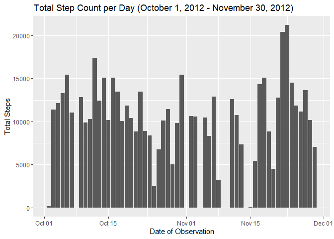
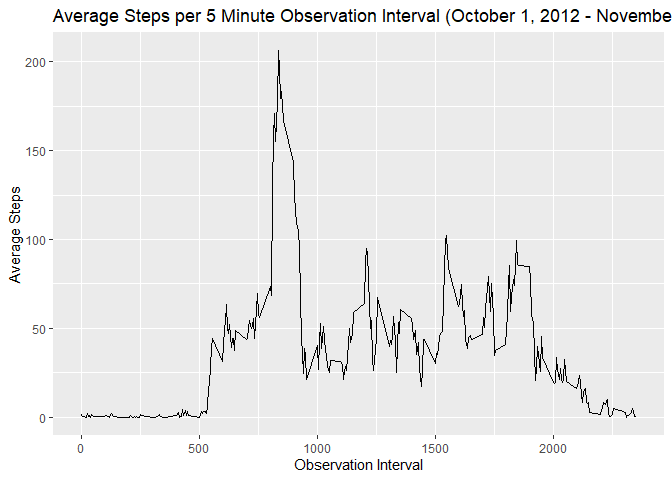
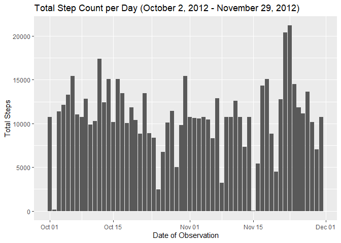
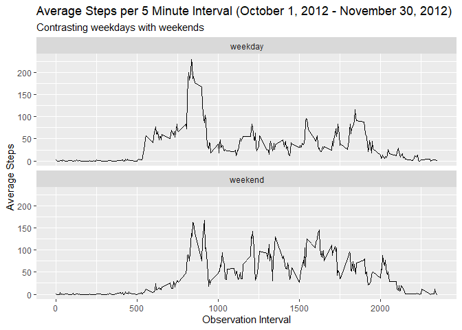

## Loading and preprocessing the data
The following analyses depend on the use of the following packages:

* tidyr

* dplyr

* lubridate

* ggplot2

For brevity's sake, the messages produced as a result of accessing these has been omitted from this markdown file. 

```r
library(tidyr); library(dplyr); library(lubridate);library(ggplot2)
```

The following code chunk creates a data directory in the current working directory if one does not exist, checks if the activity.csv file already exists in the data directory, and downloads, unzips, and reads it in as the data frame "data" if not.  

```r
if(!dir.exists("./data")){dir.create("./data")}
if(!file.exists("./data/activity.csv")){
        url1<-"https://d396qusza40orc.cloudfront.net/repdata%2Fdata%2Factivity.zip"
        download.file(url1, destfile="./data/dataset")
        unzip("./data/dataset", exdir="./data")}
data<-read.csv("./data/activity.csv")
```

This dataset includes 17,568 observations taken from an anonymous individual's personal activity monitoring device. Each row reports the number of steps taken during a 5-minute interval, the date on which the measurement was taken, and the 5-minute interval in which the data were recorded. Note that the intervals cycle for each new day.    

## What is mean total number of steps taken per day?
In order to assess the mean total number of steps, first I designate the date variable as class POSIXct if it is not already recognized as such, and aggregate the data on the date variable, summing the steps for each day.   

```r
data$date<-as.POSIXct(data$date)
data_daily<-aggregate(steps~date, data=data, FUN=sum)
```

Below, I have created a histogram for the time period of the data (October 1, 2012 - November 30, 2012).  

```r
histogram<-ggplot(data_daily, aes(x=date, y=steps))
histogram+geom_histogram(stat = "identity", bins=61)+
        labs(title="Total Step Count per Day (October 1, 2012 - November 30, 2012)",
             x="Date of Observation",
             y="Total Steps")
```

<!-- -->

For a brief overview of the 61 days in the period, I also report the mean and median daily steps below:

```r
mean(data_daily$steps)
```

```
## [1] 10766.19
```

```r
median(data_daily$steps)
```

```
## [1] 10765
```
## What is the average daily activity pattern?
Turning next to an assessment of the average daily activity pattern, I return to the original data frame and aggregate across each of the intervals per day - taking the mean steps value. 

```r
data_avg_across_days<-aggregate(steps~interval, data=data, FUN=mean)
```
Next, I plot the average steps per 5 minute interval for across the period. Unsurprisingly, there is a great deal of variation in activity over the course of the day. 

```r
tsplot<-ggplot(data_avg_across_days, aes(x=interval, y=steps))
tsplot+geom_line(size=.5)+
        labs(title="Average Steps per 5 Minute Observation Interval (October 1, 2012 - November 30, 2012)",
                 x="Observation Interval",
                 y="Average Steps")
```

<!-- -->

Consistent with the figure above, the interval that, on average, contains the most steps per day is between minutes 835 and 840. On average during this period, the individual took over 200 steps!


```r
data_avg_across_days[data_avg_across_days$steps==max(data_avg_across_days$steps, na.rm=TRUE),]
```

```
##     interval    steps
## 104      835 206.1698
```
## Imputing missing values
While these initial descriptive statistics are valuable, the data bear further scrutiny, particularly with regard to possible missing data.

```r
sum(is.na(data$steps))
```

```
## [1] 2304
```
Wow! It looks like 2304 of the 5 minute intervals in the original dataset had NA values for "steps". One strategy for handling this missingness analytically is to impute a conditional mean.

I do that here, generating a parallel dataset (data_imputed) and imputing the steps value based on the average observed value for the interval. So for example, if an observation had NA reported steps and was taken during interval 835, this code chunk would 'plug in' 206.1698 (recall above). While this technique is useful, it has some substantial limitations, particularly if we cannot specify why the data are missing. 


```r
data_imputed<- data %>%
        group_by(interval) %>%
                mutate(steps=ifelse(is.na(steps), mean(steps, na.rm=TRUE), steps))
```

Here I reproduce the figure first figure from this post using the newly imputed dataset. As before, I aggregate the data to the total number of steps per day and plot them. From this figure, you can see that certain days that had no observations previously (e.g. November 9) now have non-zero total steps.   

```r
data_daily_imputed<-aggregate(steps~date, data=data_imputed, FUN=sum)
histogram_imputed<-ggplot(data_daily_imputed, aes(x=date, y=steps))
histogram_imputed+geom_histogram(stat = "identity", bins=61)+
        labs(title="Total Step Count per Day (October 2, 2012 - November 29, 2012)",
             x="Date of Observation",
             y="Total Steps")
```

<!-- -->

Now to compare the mean and median for the imputed data to the original data file.

```r
mean(data_daily_imputed$steps); mean(data_daily$steps)
```

```
## [1] 10766.19
```

```
## [1] 10766.19
```

```r
median(data_daily_imputed$steps); median(data_daily$steps)
```

```
## [1] 10766.19
```

```
## [1] 10765
```

It looks like the mean values were identical whereas the mass of the distribution moved slightly toward zero (the median decreased slightly). Since each of these datasets has over 17,000 observations, it is not surprising that the median did not change by much. This suggests that there may have been a (nearly) random pattern of missingness as the omission of these values did not substantively impact the measures of centrality (mean/median). With that said, we would need to perform further diagnostics to assess this possibility.   

## Are there differences in activity patterns between weekdays and weekends?
Finally, it is interesting to consider how activity patterns may vary between weekdays and weekends. For the purposes of this post, weekend days only include Saturday and Sunday whereas weekdays are Monday through Friday. 

The following code generates an indicator based on the day of the week, contrasting weekdays with weekends.  

```r
data_imputed$weekday<-as.factor(weekdays(data_imputed$date))
data_imputed$wknd[data_imputed$weekday=="Saturday"]<-"weekend" 
data_imputed$wknd[data_imputed$weekday=="Sunday"]<-"weekend"
data_imputed$wknd[is.na(data_imputed$wknd)]<-"weekday"
data_imputed$wknd<-as.factor(data_imputed$wknd)
```

In order to compare weekends vs. weekdays directly, below I have plotted the average steps for each five minute interval for weekdays (top) and weekend days (bottom) respectively. By comparing these with a facet, we can see how changes may (or may not) align throughout the day for each observed interval.  

```r
weekend_data<-aggregate(steps~interval+wknd, data=data_imputed, FUN=mean)
weekend_data<-group_by(weekend_data, wknd)
tsplot2<-ggplot(weekend_data, aes(x=interval, y=steps, groups=))
tsplot2+geom_line(size=.5)+
        facet_wrap(.~wknd, nrow=2, ncol=1)+
        labs(title="Average Steps per 5 Minute Interval (October 1, 2012 - November 30, 2012)",
             subtitle= "Contrasting weekdays with weekends",
             x="Observation Interval",
             y="Average Steps")
```

<!-- -->

As you can see, while both weekdays and weekends have a peak activity around the same time as we observed for the aggregate (~830), this is largely driven by the activity on weekdays. Contrasting the two, weekends have much more activity around interval 1600 than for weekdays. It is interesting to consider what our monitored individual regularly did during these periods!  
